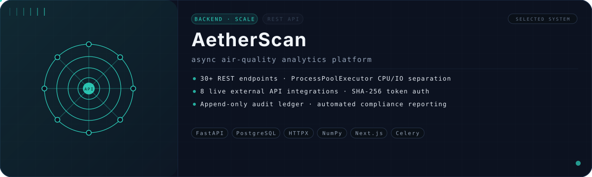
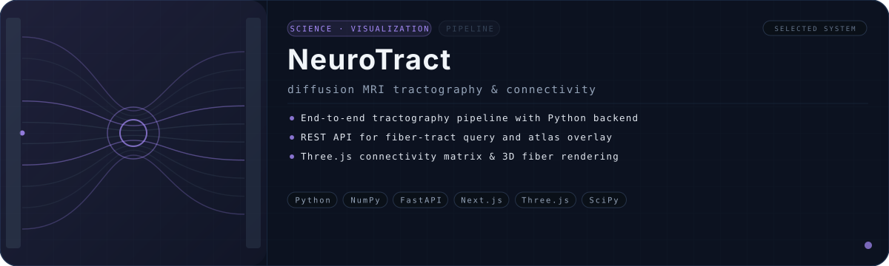
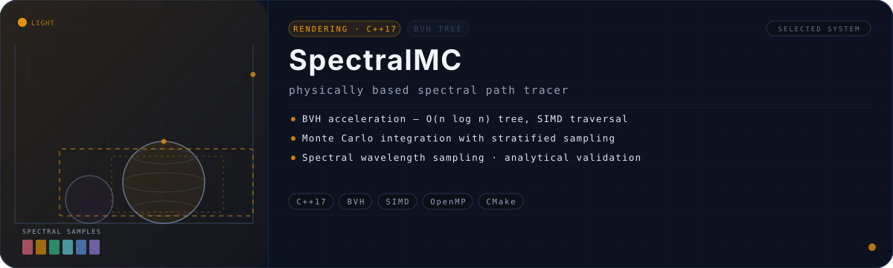
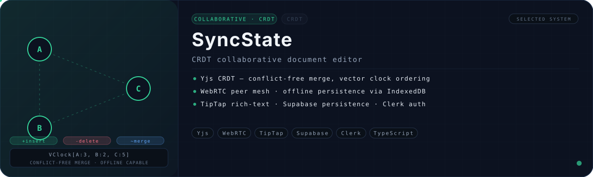
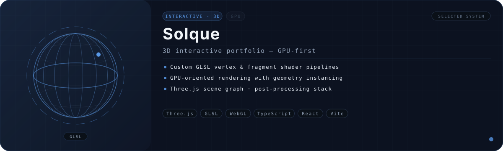
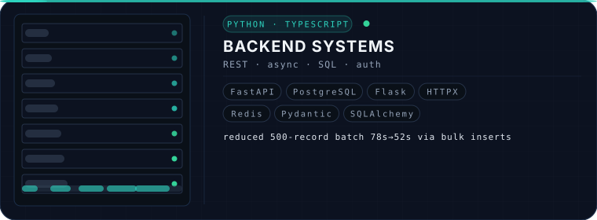
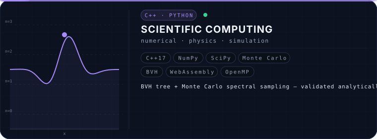
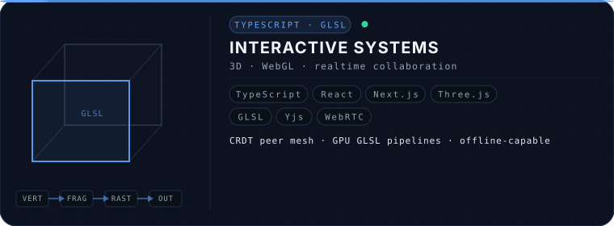
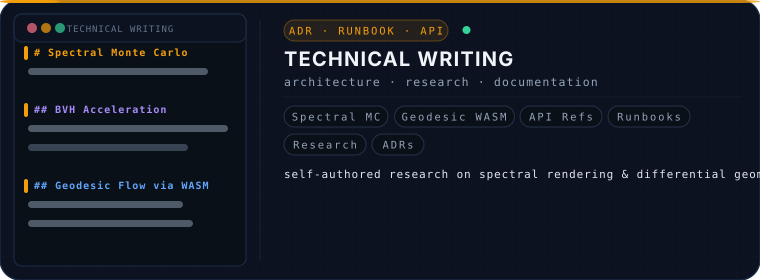

<picture>
  <source media="(prefers-color-scheme: dark)"  srcset="./assets/hero-dark.svg">
  <source media="(prefers-color-scheme: light)" srcset="./assets/hero-light.svg">
  
</picture>

 

&nbsp;
&nbsp;
&nbsp;

[`selected systems`](#selected-systems)&emsp;·&emsp;[`my stack`](#my-stack)&emsp;·&emsp;[`things i've measured`](#things-ive-measured)&emsp;·&emsp;[`what i work on`](#what-i-work-on)&emsp;·&emsp;[`get in touch`](#get-in-touch)

 

<picture>
  <source media="(prefers-color-scheme: dark)"  srcset="./assets/divider-dark.svg">
  <source media="(prefers-color-scheme: light)" srcset="./assets/divider-light.svg">
  
</picture>

 

## Selected Systems

I picked these five because they each pushed me into territory I hadn't been in before — not just "used a new library" but actually had to think differently about the problem.

 

<a href="https://github.com/sailwalpranjal/AetherScan">
<picture>
  <source media="(prefers-color-scheme: dark)"  srcset="./assets/cards/aetherscan-dark.svg">
  <source media="(prefers-color-scheme: light)" srcset="./assets/cards/aetherscan-light.svg">
  
</picture>
</a>

 

<a href="https://github.com/sailwalpranjal/Neurotract">
<picture>
  <source media="(prefers-color-scheme: dark)"  srcset="./assets/cards/neurotract-dark.svg">
  <source media="(prefers-color-scheme: light)" srcset="./assets/cards/neurotract-light.svg">
  
</picture>
</a>

 

<table width="100%">
<tr>
<td width="50%" align="center">
<a href="https://github.com/sailwalpranjal/spectral-monte-carlo-raytracer">
<picture>
  <source media="(prefers-color-scheme: dark)"  srcset="./assets/cards/spectralpathtracer-dark.svg">
  <source media="(prefers-color-scheme: light)" srcset="./assets/cards/spectralpathtracer-light.svg">
  
</picture>
</a>
</td>
<td width="50%" align="center">
<a href="https://github.com/sailwalpranjal/SyncState">
<picture>
  <source media="(prefers-color-scheme: dark)"  srcset="./assets/cards/syncstate-dark.svg">
  <source media="(prefers-color-scheme: light)" srcset="./assets/cards/syncstate-light.svg">
  
</picture>
</a>
</td>
</tr>
</table>

 

<a href="https://solque-oli7.vercel.app/">
<picture>
  <source media="(prefers-color-scheme: dark)"  srcset="./assets/cards/solque-dark.svg">
  <source media="(prefers-color-scheme: light)" srcset="./assets/cards/solque-light.svg">
  
</picture>
</a>

 

<picture>
  <source media="(prefers-color-scheme: dark)"  srcset="./assets/divider-dark.svg">
  <source media="(prefers-color-scheme: light)" srcset="./assets/divider-light.svg">
  
</picture>

 

## My Stack

These bars reflect how comfortable I actually am using each thing in a real project, not just whether I've touched it. I tend to go pretty deep on fewer tools rather than broad and shallow across many.

 

<picture>
  <source media="(prefers-color-scheme: dark)"  srcset="./assets/stack-dark.svg">
  <source media="(prefers-color-scheme: light)" srcset="./assets/stack-light.svg">
  
</picture>

 

<picture>
  <source media="(prefers-color-scheme: dark)"  srcset="./assets/divider-dark.svg">
  <source media="(prefers-color-scheme: light)" srcset="./assets/divider-light.svg">
  
</picture>

 

## Things I've Measured

I try to profile before optimising. These are a few cases where I actually sat down with real numbers instead of guessing.

 

<picture>
  <source media="(prefers-color-scheme: dark)"  srcset="./assets/metrics-dark.svg">
  <source media="(prefers-color-scheme: light)" srcset="./assets/metrics-light.svg">
  
</picture>

 

| What I was working on | What I did | What changed |
| :--- | :--- | :--- |
| AetherScan — 500-record sync batch | switched from sequential writes to bulk inserts | 78 s → 52 s &nbsp;`−33%` |
| AetherScan — FastAPI backend | separated CPU-bound work from I/O using `ProcessPoolExecutor` | 30+ endpoints, 8 live integrations |
| Yantra Byte internship | coordinated across a 6-month project, wrote up architecture decisions | ~1,050 team dev-hours |
| Spectral path tracer | built BVH acceleration, checked Monte Carlo output against analytical results | validated numerically |
| SyncState | CRDT merge with vector clocks, WebRTC mesh, IndexedDB persistence | works offline, no conflict on merge |

 

<picture>
  <source media="(prefers-color-scheme: dark)"  srcset="./assets/divider-dark.svg">
  <source media="(prefers-color-scheme: light)" srcset="./assets/divider-light.svg">
  
</picture>

 

## What I Work On

I mostly sit somewhere between backend systems, scientific/numerical software, and interactive web. None of these feel like separate worlds to me — a lot of my projects end up touching two or three of them at once.

 

<table width="100%">
<tr>
<td width="50%" align="center">
<picture>
  <source media="(prefers-color-scheme: dark)"  srcset="./assets/signals/backend-dark.svg">
  <source media="(prefers-color-scheme: light)" srcset="./assets/signals/backend-light.svg">
  
</picture>
</td>
<td width="50%" align="center">
<picture>
  <source media="(prefers-color-scheme: dark)"  srcset="./assets/signals/science-dark.svg">
  <source media="(prefers-color-scheme: light)" srcset="./assets/signals/science-light.svg">
  
</picture>
</td>
</tr>
<tr>
<td width="50%" align="center">
<picture>
  <source media="(prefers-color-scheme: dark)"  srcset="./assets/signals/interactive-dark.svg">
  <source media="(prefers-color-scheme: light)" srcset="./assets/signals/interactive-light.svg">
  
</picture>
</td>
<td width="50%" align="center">
<picture>
  <source media="(prefers-color-scheme: dark)"  srcset="./assets/signals/writing-dark.svg">
  <source media="(prefers-color-scheme: light)" srcset="./assets/signals/writing-light.svg">
  
</picture>
</td>
</tr>
</table>

 

<picture>
  <source media="(prefers-color-scheme: dark)"  srcset="./assets/divider-dark.svg">
  <source media="(prefers-color-scheme: light)" srcset="./assets/divider-light.svg">
  
</picture>

 

## Writing

I only write something up when the implementation itself is the interesting part. These are pieces I put out because I wanted a record of the thinking, not just the code.

 

<table>
<tr>
<td><strong>Spectral Monte Carlo Path Tracer</strong></td>
<td>wrote about the C++ renderer I built — BVH construction, spectral sampling, how I checked the output was actually correct</td>
</tr>
<tr>
<td><strong>Geodesic Flow via WebAssembly</strong></td>
<td>numerical integration of geodesics, compiling to WASM and running it directly in the browser</td>
</tr>
<tr>
<td><strong>Wavelength-Resolved Geodesic</strong></td>
<td>extending the geodesic work with curvature-aware sampling — more of a note-to-self that turned into a write-up</td>
</tr>
</table>

 

<picture>
  <source media="(prefers-color-scheme: dark)"  srcset="./assets/divider-dark.svg">
  <source media="(prefers-color-scheme: light)" srcset="./assets/divider-light.svg">
  
</picture>

 

## Get in Touch

 

<picture>
  <source media="(prefers-color-scheme: dark)"  srcset="./assets/contact-dark.svg">
  <source media="(prefers-color-scheme: light)" srcset="./assets/contact-light.svg">
  
</picture>

 

[`pranjalsailwal09@gmail.com`](mailto:pranjalsailwal09@gmail.com)&emsp;
[`github.com/sailwalpranjal`](https://github.com/sailwalpranjal)&emsp;
[`linkedin.com/in/pranjal-sailwal`](https://linkedin.com/in/pranjal-sailwal)&emsp;
[`orcid.org/0009-0009-5936-3512`](https://orcid.org/0009-0009-5936-3512)

 

I'm a generalist, but not in a way where everything is shallow. The through-line is: backend work, some maths, and making it observable enough that you can tell when something breaks.

 
