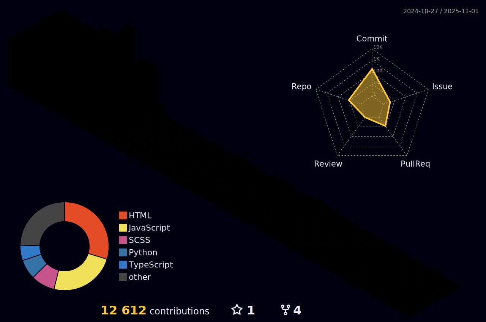

# Welcome to my Profile! 

## Name

  <!-- Name GIF -->
  

    
  

  
  <!-- Greeting Video -->
  

    <video width="100%" autoplay loop muted playsinline style="border: none; border-radius: 8px; max-height: 100%; object-fit: cover;">
      <source src="https://github.com/sailwalpranjal/sailwalpranjal/raw/main/Components/Greetings.mp4" type="video/mp4">
      Your browser does not support the video tag.
    </video>
  

## About Me

I am currently pursuing a Bachelor of Technology in Computer Science at Graphic Era Hill University, Dehradun. My academic journey is driven by a profound passion for software development, and I take great pleasure in creating innovative projects and exploring the latest advancements in technology. Here is an overview of my professional interests and activities:

- **Skill Development:** I am actively enhancing my proficiency in various programming languages and frameworks to stay at the forefront of technology.
- **Collaboration:** I am seeking opportunities to contribute to challenging open-source projects and collaborate with like-minded professionals.
- **Engagement:** I am always open to discussions and inquiries related to technology and programming. Please do not hesitate to reach out to me.
- **Contact:** You can connect with me via email at [pranjalsailwal09@gmail.com](mailto:pranjalsailwal09@gmail.com).
- **Pronouns:** He/Him

Thank you for taking the time to visit my profile. I look forward to connecting with you.

## Technologies I've Engaged With

  
<!-- Programming Languages -->

<!-- Databases -->

<!-- Frameworks & Tools -->

<!-- Additional Tools and Technologies -->

## Achievement Trophies and Rankings

  

## Contributions and Repositories

### GitHub Stats and Streak

  <table style="width: 100%; max-width: 800px; border-collapse: collapse;">
    <tr>
      <td style="border: none; padding: 0; width: 50%;">
        
      </td>
      <td style="border: none; padding: 0; width: 50%;">
        
      </td>
    </tr>
  </table>

### Activity Graph

  

### Featured Repositories

  <table style="width: 100%; max-width: 800px; border-collapse: collapse; text-align: center;">
    <tr>
      <td style="border: none; padding: 10px;">
        
      </td>
      <td style="border: none; padding: 10px;">
        
      </td>
    </tr>
  </table>

## GitHub Profile Metrics

  

## Contributions

## Connect with Me

Let's connect and stay updated on various platforms:

## Open Source Contributions

(Waiting to contribute...)

## Blog Posts and Tutorials

(Writing in progress...)

---

**Thank you for visiting!** 
If you found value in my repositories, consider giving them a star . 

Let's embark on a journey to build something **extraordinary** together! 

**Let's collaborate and innovate!** 

    

---

